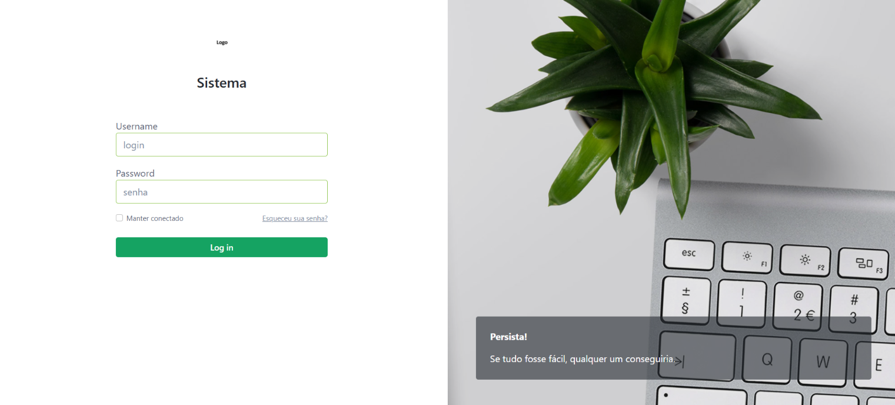

## **Objetivo**
Criar uma aplicação Laravel para gerenciar usuários e seus perfis, onde cada usuário pode ter múltiplos perfis. O objetivo é avaliar suas habilidades em PHP, Laravel, e boas práticas de desenvolvimento.

---

## **Requisitos**

1. **Autenticação de Usuário**:
   - Implementar um sistema de autenticação que permita o registro, login e logout de usuários.

2. **Gerenciamento de Usuários**:
   - Criar um módulo para gerenciar usuários, com as seguintes operações:
     - Criar
     - Editar
     - Excluir
     - Listar
    
   - Validação: Deve impedir o usuário de cadastrar se não fornecer essas informações
     - name: obrigatório
     - email: obrigatório

3. **Gerenciamento de Perfis**:
   - Criar um módulo para gerenciar perfis, com as seguintes operações:
     - Criar
     - Editar
     - Excluir
     - Listar
    
  - Validação: Deve impedir o usuário de cadastrar se não fornecer essas informações
   - perfil: obrigatório

4. **Cadastrar Perfil Administrador automaticamente (seeder)**:

5. **Relacionamento Usuário-Perfis**:
   - Um usuário pode ter múltiplos perfis (relacionamento muitos-para-muitos).
   - Criar uma funcionalidade para associar/desassociar perfis a usuários.
   - Listar os perfis de um usuário.

6. **Controle de Acesso**:
   - Apenas usuários autenticados podem acessar o sistema.
   - Apenas usuários com o perfil "Administrador" podem gerenciar perfis e associações.

---

## **Entrega**

1. **Repositório**:
   - Atualize esse repositório.

2. **README-novo do Projeto**:
   - Crie um novo Readme "Readme-novo.md"
   - Inclua as seguintes informações:
     - Descrição do projeto.
     - Passos para configurar o ambiente.
     - Como rodar as migrations e seeders.
     - Usuário e senha de teste para login.

4. **Pontos de Verificação**:
   - O sistema deve atender a todos os requisitos mencionados.

---

## **Critérios de Avaliação**

1. **Funcionamento**:
   - A aplicação atende a todos os requisitos funcionais descritos?

2. **Interface e Usabilidade**:
   - A aplicação possui uma interface clara e funcional?

3. **Código**:
   - O código é legível.

---

## **Configuração do Projeto**

### **Requisitos**
- PHP >= 8.0
- Composer
- Banco de dados relacional (MySQL, Sqlite, PostgreSQL ou outro compatível com Laravel)
- Laravel >= 10.x
- Frontend - Livre escolha

---

## **Commit**
- Faça o clone deste Readme e suba no seu repositório pessoal


## **PASSO A PASSO RODAR APLICAÇÃO**

### Aplicação Laravel que possuí o gerenciamento de usuários, perfis e permissões

### **Observação**
- É recomendável ter o docker rodando na máquina para executar os passos abaixo

#### Fazendo uso do terminal, clone o projeto:
```powershell
git clone https://github.com/tiagotsc/app-laravel.git
```   

#### Na pasta raiz (tem as pastas phpdocker, sistema e arquivos docker-compose.yml e README.md), rode:
```powershell
docker-compose up -d
```

#### Entre no container php com o comando:
```powershell
docker-compose exec php-fpm bash
```

#### Ainda dentro do container entre no diretório da aplicação:
```powershell
cd sistema
```

#### Instale os pacotes com o seguinte comando:
```powershell
composer install --ignore-platform-req=ext-intl --ignore-platform-req=ext-gd
```

#### Cria as tabelas
```powershell
php artisan migrate
```

#### Alimenta as tabelas
```powershell
php artisan db:seed
```

#### Acesse a aplicação com usuário administrador:
- Usuário: admin
- Senha: admin

#### No navegador, acesse a aplicação através da seguinte URL:
- http://localhost

#### Tudo ocorrendo bem, vocês irão se deparar com a seguinte tela:

